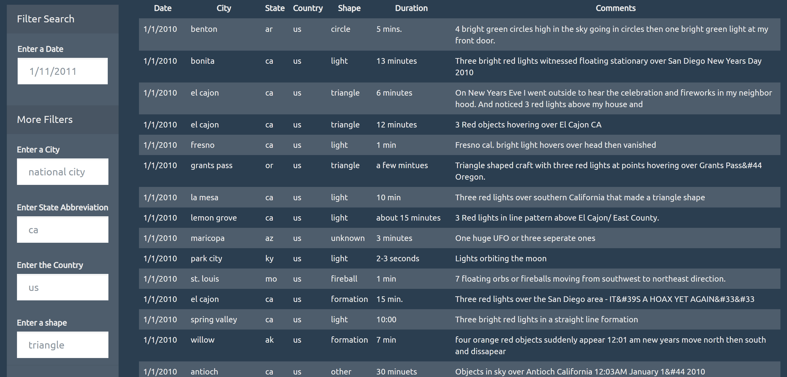

# UFO Sightings Table with DOM Manipulation

Dynamic table based upon a dataset containing eye-witness reports of extra-terrestrial life and capable of filtering the table data for specific values. Table only built with JavaScript, HTML, CSS, and D3.js on the web page.

## Search for the Truth

## Steps

- Create a basic HTML web page.
- Append a table to your web page and then add new rows of data for each sighting.
  - Provide a column for date/time, city, state, country, shape, and comment.
- Use a date form in the HTML document and write JavaScript code that will listen for events and search through the date/time column to find rows that match user input.
- Using multiple input tags and dropdowns, write JavaScript code to allow the user to set multiple filters and search for sightings using the following criteria:
  - date/time
  - city
  - state
  - country
  - shape

## Sightings Table

## Authors

- **David W. Mueller**
  - [LinkedIn Profile](https://www.linkedin.com/in/davidwaltermueller/)
  - davemuelle@gmail.com

## Acknowledgments

- Michigan State University Data Analytics Bootcamp; June 24, 2021.
